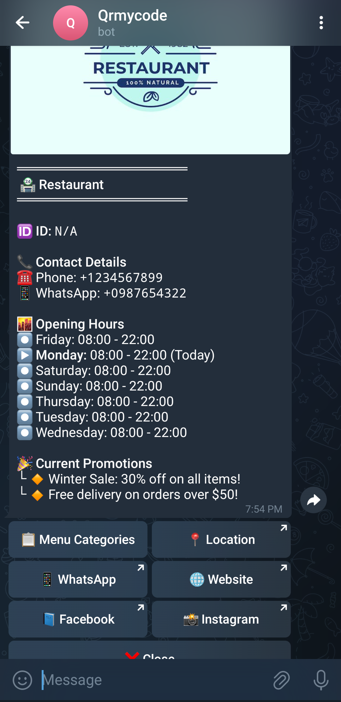

# Restogram 🍽️🤖

**Bienvenue à Restogram, votre bot Telegram pour explorer les menus de restaurants !**  
Avec une interface conviviale, des emojis accrocheurs et une mise en page intuitive, ce bot vous aide à découvrir les menus, horaires d'ouverture et promotions des restaurants près de chez vous.

---

## 🌟 Introduction  

🎉 **Restogram**, le bot qui rend la découverte culinaire amusante et engageante !  
Consultez facilement les informations des restaurants directement depuis Telegram :

- 📜 Menus détaillés.  
- 🕒 Heures d'ouverture en temps réel.  
- 💰 Promotions spéciales.  

💡 **Simplifiez vos recherches tout en gardant une expérience utilisateur soignée.**

---

## 🛠️ Installation  

### Étapes pour installer et lancer Restogram :
1. **Clonez le dépôt :**  
    ```bash
    git clone https://github.com/elmansouri-port/Restogram.git
    cd restogram
    ```
2. **Installez les dépendances :**  
    ```bash
    pip install python-telegram-bot requests
    ```
3. **Configurez le token Telegram :**  
   Remplacez le token dans le fichier `bot.py` par votre propre token Telegram.  

4. **Lancez le bot :**  
    ```bash
    python bot.py
    ```

---

## 🚀 Utilisation  

### Comment utiliser Restogram ?  
1. **Recherchez le bot sur Telegram** (ex. : `@RestogramBot`).  
2. **Envoyez `/start`** pour commencer.  
3. **Tapez le nom d’un restaurant** pour afficher son menu, ses horaires et ses promotions.  

🎯 **Navigation intuitive** avec des boutons interactifs pour un accès rapide !  

---

## 🎁 Fonctionnalités  

### Ce que propose Restogram :
- 📅 **Horaires d'ouverture** en temps réel.  
- 🎉 **Promotions** disponibles.  
- 🔘 **Boutons interactifs** pour une navigation simplifiée.  
- 🌐 **Liens directs** vers le site web ou WhatsApp des restaurants.  
- ✨ **Styling moderne** avec emojis pour une expérience agréable.  

---  

📸 **Capture d’écran**  
Ajoutez ici des captures d’écran ou des GIF montrant l'interface du bot.
### 1. Start and Help Menu


### 2. Restaurant Info


### 3. Product Info

---

## 🛠️ Dépannage  

### Vous rencontrez des problèmes ?  
- Si le bot ne répond pas :  
  - Vérifiez votre **token Telegram**.  
  - Assurez-vous que vous avez une **connexion Internet active**.  

- Si les données ne sont pas récupérées :  
  - Assurez-vous que l'**API backend** fonctionne correctement.

---

## 🤝 Contribution  

### Contribuer à Restogram :  
Nous accueillons avec plaisir vos contributions !  
1. **Forkez ce dépôt.**  
2. **Créez une nouvelle branche :**  
   ```bash
   git checkout -b feature/your-feature-name
